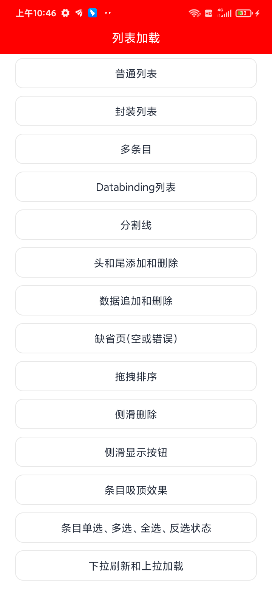

# VipList
一个超简单的列表加载，添加头尾，缺省页，拖拽排序，侧滑删除，DataBinding，设置分割线，吸顶效果，等等，从未如此简单！


<p align="center"></p>

<p align="center">
    <strong>超简单的RecyclerView加载框架</strong>
    <br>
    <br>
    <a href="">使用文档</a>
    | <a href="">下载体验</a>
    <br><br>
    
    <br><br>
    本库长期维护，欢迎大家提出问题，均第一时间解决！
</p>

## VipList主要功能【截止2022年12月23日】

- [x] 支持传统模式Adapter加载
- [x] 快速创建列表加载
- [x] 快速创建多布局列表
- [x] 支持添加头和尾
- [x] 支持缺省页面动态设置
- [x] 支持DataBinding形式条目加载
- [x] 支持DataBinding形式列表加载
- [x] 支持多种分割线样式
- [x] 支持选择模式(多选/单选/全选/取消全选/反选)
- [x] 拖拽排序
- [x] 侧滑删除
- [x] 支持侧滑按钮，可动态传递侧滑按钮视图
- [x] 支持条目吸顶效果
- [x] 支持下拉刷新和上拉加载（结合SmartRefreshLayout实现）
- [x] 自动分页加载数据

## VipList快速使用

1、在你的根项目下的build.gradle文件下，引入maven。

```groovy
allprojects {
    repositories {
        maven { url "https://gitee.com/AbnerAndroid/almighty/raw/master" }
    }
}
```
2、在你需要使用的Module中build.gradle文件下，引入依赖。

为了方便大家使用，目前拆分了三个依赖，大家可以进行有选择使用，如果你的项目没有下拉刷新和上拉加载，可以直接使用relist，如果已经
有了自己的上拉下拉库，可以使用list，list库是对RecyclerView做的封装，简化了调用，拓展了一些功能，可以更加方便的让你使用，特别
，特别的简单。

|  依赖  |  概述  |  版本号  |  集成  |
|  ----  |  ----  |  ----  |  ----  |
|  relist  |  一个包含了列表加载和下拉刷新、上拉加载的库  |  1.0.0  |  implementation 'com.vip:relist:1.0.0'  |
|  list  |  只包含列表加载（添加头尾、缺省页、侧滑删除、吸顶效果、分割线、DataBinding等）  |  1.0.0  |  implementation 'com.vip:list:1.0.0'  |
|  refresh  |  只包含下拉刷新、上拉加载  |  1.0.0  |  implementation 'com.vip:refresh:1.0.0'  |


#### 具体引入

大家注意有选择进行使用，relist包含list和refresh，用了relist，list和refresh，就不要再引入了！！！

```groovy
dependencies {
    implementation 'com.vip:relist:1.0.0'//一个包含了列表加载和下拉刷新、上拉加载的库，它包含了下面的两个库，使用它，下面的两个就不要引用了。
    implementation 'com.vip:list:1.0.0'//列表加载库，如果使用了relist，这个不要再引用
    implementation 'com.vip:refresh:1.0.0'//下拉刷新、上拉加载库，如果使用了relist，这个不要再引用
}
```

## 欢迎关注作者

微信搜索【Android干货铺】，或扫描下面二维码关注，查阅更多技术文章！


## License

```
Copyright (C) AbnerMing, VipList Open Source Project

Licensed under the Apache License, Version 2.0 (the "License");
you may not use this file except in compliance with the License.
You may obtain a copy of the License at

     http://www.apache.org/licenses/LICENSE-2.0

Unless required by applicable law or agreed to in writing, software
distributed under the License is distributed on an "AS IS" BASIS,
WITHOUT WARRANTIES OR CONDITIONS OF ANY KIND, either express or implied.
See the License for the specific language governing permissions and
limitations under the License.
```
